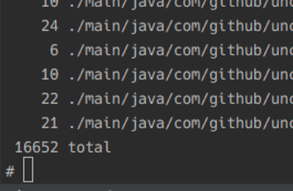
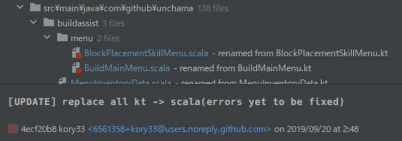

<style>
section {
  font-size: 30px;
}
</style>

# **1万7千行のKotlinを2週間かけ力尽くでScalaに移行した話**

## How I migrated 17k Kotlin lines to Scala in a fortnight by force

by kory33 (@Kory__3)

---

# Note

全てのスライドで、タイトルは英語、本文は日英併記という形式を取ります。

All slide titles will be in English. Main texts will be in Japanese, accompanied by English translations and sidenotes if needed.

---

# Self-Introduction

---

# Self-Introduction

 - ## 数学とCSをやっている学部一年生(夏休み中)
   A first-year undergraduate studying Math + CS, currently on a vacation
 - ## Ubie社でインターン中
   Internship at Ubie Inc.
 - ## 整地サーバー運営
   Server dev-admin at Seichi Server

---

# Seichi Server？　　　　　

---

# Seichi Server (Officially *Gigantic Seichi Server*)

 - 日本で最も大きな公開Minecraftサーバーの一つ
   One of the largest public Minecraft servers in Japan

#

 - Minecraftを拡張し、プレーヤーが**大量に**ブロックを破壊できるように
   The game is tweaked; players can break **a lot** of blocks

(Seichi stands for grading, levelling the ground)

---


「整地スキル」使用中のプレーヤー / a player using *Seichi skill*

---

# SeichiAssist

[https://github.com/GiganticMinecraft/SeichiAssist](https://github.com/GiganticMinecraft/SeichiAssist)

---

# SeichiAssist

 - ブロックを壊すだけではなく、それに付随する様々な基盤がくっついている
   The server has many subsystems, not necessarily related to breaking blocks

 - これらの基盤の**すべて**を任されているのが SeichiAssist というソフトウェア
   *SeichiAssist* is a software that handles *all* concerns of this large system

---

# SeichiAssist - at the beginning of year 2018

 - システムはどんどん複雑化し、バグが混入しても容易にfixできなくなった
   The growing system had become too complex; bugfix was very difficult

#

 - 機能開発をほぼ止めてリファクタリング/再実装に注力しようという話になったのが2018年初頭
   The beginning of 2018 was when the team decided to concentrate on refactoring / reimplementation rather than adding new features

---

# So we moved to Kotlin ... at first

 - Kotlinへの移行はとても楽
   Migration to Kotlin from Java is easy

 - IntelliJ IDEAに入っているJava -> Kotlinのコンバータの精度がとても良い
   IntelliJ IDEA provides a very accurate Java-to-Kotlin converter

 - Java -> Scalaのコンバータは割と動かないコードを吐いた
   Java-to-Scala converter by IntelliJ often yielded code that doesn't compile

 - チームでKotlinの方が書ける人が多かった
   The dev team was more comfortable with Kotlin than with Scala

---

# So we moved to Kotlin ... at first

いくらかのソースコードをKotlinに変換しフォーマット等をしていたが、そもそも状態が複雑すぎるということで純粋関数型プログラミングに頼ることに…

We converted several `.java`s to `.kt`, formatting or cleaning them along the way. But it seemed we had to lean towards purely functional programming to simplify internal states...

---

# Λrrow (https://arrow-kt.io/)

Kotlinでの純粋関数型及びジェネリックプログラミングをサポートするライブラリ

Library supporting purely functional and generic programming in Kotlin

---

# suspend function

 `suspend function` は評価機(`CoroutineContext`)を切り替えられるため、モナディックプログラミングまで自然に応用できる
 
 #

 The interpreter of `suspend` uses `CoroutineContext`, which is not bound to the language, so `suspend`'s usage naturally extends to monadic programming

---

# Λrrow + suspend function

```Kotlin
val result = Option.fx {
    val (one) = Option(1)
    val (two) = Option(one + one)
    two
}
```

```Kotlin
val result =
    Either.fx<Throwable, Int> {
        val (one) = Either.right(1)
        val (two) = Either.right(one + one)
        two
    }
```
(from arrow-kt website, https://arrow-kt.io/docs/0.10/fx/polymorphism/)

---

<!-- ここまで大体5分 -->

# But wait...

 - KotlinにはHigher Kinded Typeは無い
   Kotlin does not have Higher Kinded Type

   - Λrrowは Type Indexed Value 辺りの手法でHKTをエミュレートしている
     Λrrow therefore emulates HKT using Type Indexed Value etc.

     [Qiita - Java で higher kinded polymorphism を実現する](https://qiita.com/lyrical_logical/items/2d68d378a97ea0da88c0)

#

 - 文法上は書きやすいかもしれないが定義側にマクロが多いように見えた
   Maybe Kotlin + Λrrow is easy to read, but seemed to involve a lot of macros and metaprogramming on declaration site

---

# But wait...

 - 他開発者に対する学習コストがどれほどかがあまり見えなかった
   Learning cost of the framework for other developers was unknown to me

#

 - 仕組みを質問され完全に答えられる程度になるのに自分も時間が掛かりそう
   I thought it'd take a lot for me to be able to understand the internals

---

# So ... Scala? (+ Cats?)

まだKotlinの行数少ないし移行できるのでは？

Maybe it is not too late to move everything to Scala

---

# How much Kotlin do we Have?

`find . -name '*.kt' | xargs wc -l`

---

# How much Kotlin do we have?

`find . -name '*.kt' | xargs wc -l` 

### .. 17328 lines!



---

<style scoped>
h1 {
  margin: auto;
}
</style>

# 🤔🤔🤔

---

# The Strategy

## KotlinとScalaは共存できない
Kotlin and Scala cannot coexist in the same project

 - コンパイル順に依存関係があり、Java + Kotlin + Scalaを同時にコンパイルできない
   There is an internal dependency in the compilation. We cannot compile Java + Kotlin + Scala at the same time

## KotlinとScalaの文法はとても似ている
Kotlin and Scala are very similar in syntax

---

# The Strategy - similar syntax

Scala
```Scala
def someIntFunction(): Int = {
    println("aaa")
    2
}
```

Kotlin
```Kotlin
fun someIntFunction(): Int {
    println("aaa")
    return 2
}
```

---

# The Strategy - similar syntax 2

Scala

```Scala
someCollection.foreach { elem =>
    println(elem.property)
}
```

Kotlin

```Kotlin
someCollection.forEach {
    println(it.property) // 'it' references lambda parameter
}
```

---

# The Strategy

 - ソースファイル間での依存がかなり複雑で、サブプロジェクトにScalaを切り出して行くのはかなり困難であった
   Dependencies between the source files were complex. Factoring out scala to a subproject was very difficult, if not infeasible.

#

 - 一括でやるしかなさそう
   It seemed like doing everything in one shot was the only option

   - ネタバレをすると、14日間一度もコンパイルは通らなかった
     Spoiler alert: In fact, the source could not be compiled for 14 days
---

# So ...

---

# Into Fire

138 Files Renamed ([`4ecf20b8`](https://github.com/GiganticMinecraft/SeichiAssist/commit/4ecf20b8))



(実はこのコミット前に少しだけScalaへ移す試みをしていますが、そこでインクリメンタルな移行が不可能だと悟っています
Right before this commit was an attempt to migrating incrementally; I soon surmised this was impossible)

---

# The easy part

---

# The easy part - syntactic replacement

 - Scalaコードに自明に対応するKotlinコードはプロジェクトに全体置換を書ければ済む
   Kotlin code that has trivial Scala counterpart can be replaced in the whole project
   - `R-Click /src -> Replace in Path` on IDEA

#

 - とはいっても別言語。この置換は単純なものが多いとはいえ慎重に正規表現を組む必要はある。
   Kotlin and Scala are two different languages. We need to carefully design regexp to perform project-wide replacement!

---

# The easy part - syntactic replacement

## Generics ([`8d178516`](https://github.com/GiganticMinecraft/SeichiAssist/commit/8d178516))

```Regexp
<([^<>,:]*)(?<!-)>               to  \[$1\]
<([^<>,:]*), ?([^<>,:]*)(?<!-)>  to  \[$1, $2\]
<([^<>,:]*) ?: ? ([^<>,:]*)>     to  \[$1 <: $2\]
->                               to  =>
```

```diff
- reverseAccumulator: List<Any> = listOf()): Option<Pair<List<Any>, List<String>>> {
+ reverseAccumulator: List[Any] = listOf()): Option[Pair[List[Any], List[String]]] {
```

```diff
-private tailrec suspend def <CS : CommandSender>
-    parse(parsers: List<(String) -> ResponseEffectOrResult<CS, Any>>,
+private tailrec suspend def [CS <: CommandSender]
+    parse(parsers: List[(String) => ResponseEffectOrResult[CS, Any]],
```

---

# The easy part - syntactic replacement

## String interpolations ([`07f6f437`](https://github.com/GiganticMinecraft/SeichiAssist/commit/07f6f437))

```Regexp
(?<!s)(\".*\$.*\")   to   s$1
```

```diff
-        .title("$YELLOW$UNDERLINE${BOLD}元のページへ")
-        .lore("$RESET$DARK_RED${UNDERLINE}クリックで移動")
+        .title(s"$YELLOW$UNDERLINE${BOLD}元のページへ")
+        .lore(s"$RESET$DARK_RED${UNDERLINE}クリックで移動")
```

---

# The easy part - syntactic replacement

## Class `extends` ([`7a1e1175`](https://github.com/GiganticMinecraft/SeichiAssist/commit/7a1e1175))

```Regexp
class ([A-Za-z]+(\[.*\])?(\s*(protected|private)\s*)?(\(.*\))?\s*)\:(\s*?\S+)
to
class $1 extends $6
```

```diff
-class BungeeReceiver(private val plugin: SeichiAssist) : PluginMessageListener {
+class BungeeReceiver(private val plugin: SeichiAssist)  extends  PluginMessageListener {
```

(スペースが余分に入っているがlintで後で消すのでこういうのは無視
Extra spaces around `extends` will be eventually eliminated by the linter)

---

# The easy part - syntactic replacement

## Other conversions

```Regexp
listOf                    to  List                   (list constructor)
def (\[[^\]]*\]) ([^\(]*) to  def $2$1        (generic function definition)
object (\S+)\s*:\s*(\S+)  to  object $1 extends $2    (object extends)
\)\: ([A-Z]\S+) \{        to  \)\: $1 = \{  (Scala's method is a single expression)
([A-Za-z)])!!             to  $1                  (ignore assert-non-null)
as ([A-Z]\w+)             to  \.asInstanceOf\[$1\]      (downcasts)
typealias                 to  type                     (type aliases)
```

その他小さな全体置換

and other minor syntactic replacements

---

# The harder part

---

# The harder part - `break`, `continue`

---

# The harder part - `break`, `continue`

Scalaには`break` / `continue`という制御構文が無い

Scala does not have `break` or `continue`

#

 - `scala.util.control.Breaks` !

---

# The harder part - `suspend`

---

# The harder part - `suspend`

```Kotlin
// block the main thread until all launched coroutines are finished
fun main() = runBlocking {
    launch { doWorld() }
    println("Hello,")
}

suspend fun doWorld() {
    // delay is another suspend fun
    // the execution "pauses" before this call
    delay(1000L)

    // the execution continues ...
    println("World!")
}
```
(adopted from Kotlin Programming Language, https://kotlinlang.org/docs/reference/coroutines/basics.html)


---

# The harder part - `suspend`

 - Kotlinの `suspend fun ...(): R` は実は `Continuation[R]` を取る普通の関数
   Kotlin's `suspend fun ...(): R` is actually an ordinary function that takes `Continuation[R]` as an extra argument
 
 # 

 - 最初はシグネチャを変えて回っていたが、むしろエラーが増えて見通しが悪くなりそうということで `@SuspendingMethod` アノテーションを作り、 `suspend def -> \@SuspendingMethod def` と置換した
   At the beginning I was changing the signatures to take the extra parameter. This turns out to just increase errors, so I decided to fabricate a `@SuspendingMethod` annotation and applied `suspend def -> \@SuspendingMethod def`.

---

# The harder part - Scoped functions and Extension functions

```Kotlin
fun scopedFunction(f: ExistingType.() -> Unit): Unit { ... } // scoped function

fun ExistingType.extfun(): Int { ... } // extfun
```

 - `implicit class` を使った enrich-my-library パターンで解決
   Can be resolved using enrich-my-library pattern through `implicit class`es

---

# The harder part - Nullability

Kotlinは `null` に関する操作が充実している
Kotlin has convenient operations to manipulate `null`s

```Kotlin
val nullableProperty: Int? = nullableValue?.property // safe calls
```

```Kotlin
val result = nullableExpression ?: return -1 // elvis operator
```

---

# The harder part - Nullability

`Option`に包み、elvis演算子は汎用的な `implicit class` を用意することで解決する
Wrapping nullables in `Option` is a way. Having generic `implicit class` eliminates needs for `?:`

```Scala
object Nullability {
  implicit class NullabilityExtensionReceiver[T](val receiver: T) extends AnyVal {
    def ifNull(f: => T): T = if (receiver == null) f else receiver
  }
}
```
```Scala
import {...}.Nullability._

val result = nullableExpression.ifNull { return -1 }
```

---

# The most difficult part

---

# The most difficult part - Java-site getter/setter

---

# The most difficult part - Java-site getter/setter

KotlinはJava側で定義された `E.getSomething` と `E.setSomething` といった**メソッド**を`E.something` や `E.something = ...` とアクセスできる**プロパティ**にラップする機能がある

Kotlin has a feature to wrap `get`ters and `set`ters defined in Java class as *properties*.

```Java
public final class SomeClass {
    private int field = 1;
    public SomeClass() { ... }

    public int getField() { return field; }
    public void setField(int newValue) { field = newValue }
}
```

```Kotlin
someClassValue.field = someClassValue.field + 1
```

---

# The most difficult part - Java-site getter/setter

この機能はKotlinからJavaを触る際には便利で、使用感も良い。SeichiAssistではそこそこの量のコードがこの機能を使用していた。

This feature feels very ergonomic when interacting with Java class from Kotlin. SeichiAssist had been extensively utilizing this getter/setter-to-property conversion.

---

<style scoped>
h2 {
  margin: auto;
}
</style>

# 

## Scala did not have this feature!

コンパイラプラグインを書けばあるいは…？(本当に？)
Maybe a compiler plugin could help here? I don't really know...

---

# The most difficult part - Java-site getter/setter

文法上は「本当にJavaのクラスのプロパティに直接代入している」のか、Kotlinにより生成されたプロパティへの代入なのか区別がつかない

Syntactically, direct assignment to a field is indistinguishable from an assignment to Kotlin-generated property based on a setter

#

Getterに関しても同じ (Scalaでの `.getPlayer` はKotlinでは `.player` に見える)

The same goes for getters; `.player` in Kotlin looks like `.getPlayer` in Scala.

---

# Java-site getter/setter - What I did

プロジェクト内で「殆どの場合 getter を呼んでいるプロパティアクセス」を見分けることができる。例えば `.onlinePlayers` はプロパティとして**定義していなかった**から、直後に` =`が来ていない時点でこれがすぐにgetter呼び出しだとわかる

It is often possible to affirm that a certain property calls are *definitely* getter calls. For example, `.onlinePlayers` was *never defined* as a property. No ` =` implies this is a getter access!

### Now we can employ the POWER of RegExp
  
```RegExp
.onlinePlayers(?<! ?=)      to  .getOnlinePlayers
.onlinePlayers(?<= ?=)(.*)  to  .setOnlinePlayers($1)
```

---

# Java-site getter/setter - The remaining part

では見分けられなさそうな非自明なプロパティアクセスは？そもそもプロパティアクセスは数百数千とかそういう種類あるけど？

So what to do for nontrivial property accesses? There are hundreds or thousands of such property accesses!

---

# Java-site getter/setter - The remaining part

#

## 👉がんばる。

#

## 👉Try hard.

---

# Java-site getter/setter - The remaining part

多分時間の6から7割はどうしてもここに吸われる。技術的に自動置換は不可能ではないけれど、それを実装するくらいだったら**力尽くでやったほうが早い**…という判断をした。多分正しかった。

#

Nearly 60 or 70 percent of effort went here. It is *not impossible* to implement an automatic translation... but my judge was that it is *faster to do everything by force*. I still think I was right.

---

# Conclusion

 - 構文論的に変換できる部分は比較的簡単
   Syntactic conversion is rather easy

 - 構文が対応しない所はターゲット言語の機能やアノテーションを使えばイイ感じになる場合がある
   When the syntactic concepts don't agree, using some feature in the target language or annotation may resolve the translation issue

 - 元言語の一つの構文がターゲット言語で二つの機能に分かれる場合つらい。頑張るしかない。
   When an unified syntax in the original language corresponds to two different syntaxes in the target language, that is going to be a big problem
