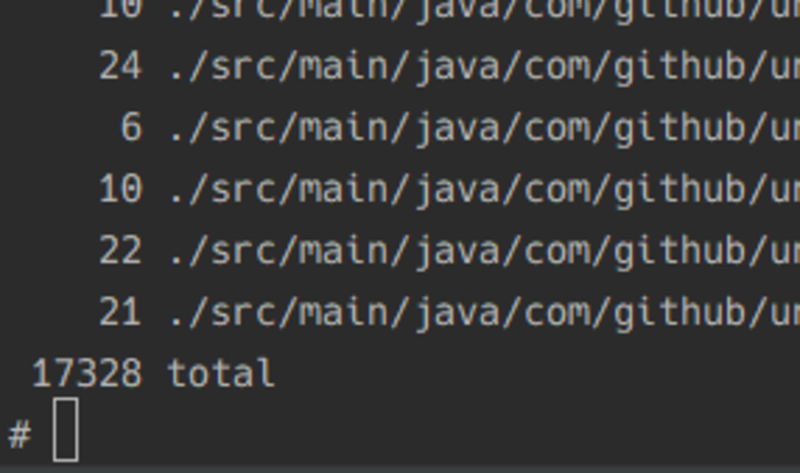

<style>
section {
  font-size: 30px;
}
</style>

# **1万7千行のKotlinを力尽くでScalaに移行した話**

## How I migrated 17k Kotlin lines to Scala by force

by kory33 (@Kory__3)

---

# Note

全てのスライドで、タイトルは英語、本文は日英併記という形式を取ります。

All slide titles will be in English. Main texts will be in Japanese, accompanied by English translations and sidenotes if needed.

---

# Self-Introduction

---

# Self-Introduction

 - ## 数学とCSをやっている学部一年生(夏休み中)
   A first-year undergraduate studying Math + CS, currently on a vacation
 - ## Ubie社でインターン中
   Internship at Ubie Inc.
 - ## 整地サーバー運営
   Server dev-admin at Seichi Server

---

# Seichi Server？　　　　　

---

# Seichi Server (Officially *Gigantic Seichi Server*)

 - 日本で最も大きな公開Minecraftサーバーの一つ
   One of the largest public Minecraft servers in Japan

 - Minecraftを拡張し、プレーヤーが**大量に**ブロックを破壊できるように
   The game is tweaked; players can break **a lot** of blocks

(Seichi stands for grading, levelling the ground)

---


「整地スキル」使用中のプレーヤー / a player using *Seichi skill*

---

# SeichiAssist

[https://github.com/GiganticMinecraft/SeichiAssist](https://github.com/GiganticMinecraft/SeichiAssist)

---

# SeichiAssist

 - ブロックを壊すだけではなく、それに付随する様々な基盤がくっついている
   The server has many subsystems, not necessarily related to breaking blocks

 - これらの基盤の**すべて**を任されているのが SeichiAssist というソフトウェア
   *SeichiAssist* is a software that handles *all* concerns of this large system

---

# SeichiAssist - at the beginning of year 2018

 - システムはどんどん複雑化し、バグが混入しても容易にfixできなくなった
   The growing system had become too complex; bugfix was very difficult

 - 機能開発をほぼ止めてリファクタリング/再実装に注力しようという話になったのが2018年初頭
   The beginning of 2018 was when the team decided to concentrate on refactoring / reimplementation rather than adding new features

---

# So we moved to Kotlin ... at first

 - Kotlinへの移行はとても楽
   Migration to Kotlin from Java is easy

 - IntelliJ IDEAに入っているJava -> Kotlinのコンバータの精度がとても良い
   IntelliJ IDEA provides a very accurate Java-to-Kotlin converter

 - Java -> Scalaのコンバータは割と動かないコードを吐いた
   Java-to-Scala converter by IntelliJ often yielded code that doesn't compile

 - チームでKotlinの方が書ける人が多かった
   The dev team was more comfortable with Kotlin than with Scala

---

# So we moved to Kotlin ... at first

いくらかのソースコードをKotlinに変換しフォーマット等をしていたが、そもそも状態が複雑すぎるということで純粋関数型プログラミングに頼ることに…

We converted several `.java`s to `.kt`, formatting or cleaning them along the way. But it seemed we had to lean towards purely functional programming to simplify internal states...

---

# Λrrow (https://arrow-kt.io/)

Kotlinでの純粋関数型及びジェネリックプログラミングをサポートするライブラリ

Library supporting purely functional and generic programming in Kotlin

---

# suspend function

```Kotlin
// block the main thread until all launched coroutines are finished
fun main() = runBlocking {
    launch { doWorld() }
    println("Hello,")
}

suspend fun doWorld() {
    // delay is another suspend fun
    // the execution "pauses" before this call
    delay(1000L)

    // the execution continues ...
    println("World!")
}
```
(adopted from Kotlin Programming Language, https://kotlinlang.org/docs/reference/coroutines/basics.html)


---

# suspend function

 `suspend function` は評価機(`CoroutineContext`)を切り替えられるため、モナディックプログラミングまで自然に応用できる
 
 The interpreter of `suspend` uses `CoroutineContext`, which is not bound to the language, so `suspend`'s usage naturally extends to monadic programming

---

# Λrrow + suspend function

```Kotlin
val result = Option.fx {
    val (one) = Option(1)
    val (two) = Option(one + one)
    two
}
```

```Kotlin
val result =
    Either.fx<Throwable, Int> {
        val (one) = Either.right(1)
        val (two) = Either.right(one + one)
        two
    }
```
(from arrow-kt website, https://arrow-kt.io/docs/0.10/fx/polymorphism/)

---

<!-- ここまで大体5分 -->

# But wait...

 - KotlinにはHigher Kinded Typeは無い
   Kotlin does not have Higher Kinded Type

   - Λrrowは Type Indexed Value 辺りの手法でHKTをエミュレートしている
     Λrrow therefore emulates HKT using Type Indexed Value etc.

     [Qiita - Java で higher kinded polymorphism を実現する](https://qiita.com/lyrical_logical/items/2d68d378a97ea0da88c0)

 - 文法上は書きやすいかもしれないが定義側にマクロが多いように見えた
   Maybe Kotlin + Λrrow is easy to read, but seemed to involve a lot of macros and metaprogramming on declaration site

---

# But wait...

 - 他開発者に対する学習コストがどれほどかがあまり見えなかった
   Learning cost of the framework for other developers was unknown to me

 - 仕組みを質問され完全に答えられる程度になるのに自分も時間が掛かりそう
   I thought it'd take a lot for me to be able to understand the internals

---

# So ... Scala? (+ Cats?)

まだKotlinの行数少ないし移行できるのでは？

Maybe it is not too late to move everything to Scala

---

# How much Kotlin do we Have?

`find . -name '*.kt' | xargs wc -l`

---

# How much Kotlin do we Have?

`find . -name '*.kt' | xargs wc -l` 

### .. 17328 lines!



---

<style scoped>
h1 {
  margin: auto;
}
</style>

# 🤔🤔🤔

---

# The Strategy

## KotlinとScalaは共存できない
Kotlin and Scala cannot coexist in the same project

 - どちらかの言語を先にコンパイルしないとバイトコードを読みに行けない
   Either the language has to be compiled first so that one language can read other's byte code

## KotlinとScalaの文法はとても似ている
Kotlin and Scala are very similar in syntax

---

# The Strategy - similar syntax

Scala
```Scala
def someIntFunction(): Int = {
    println("aaa")
    2
}
```

Kotlin
```Kotlin
fun someIntFunction(): Int {
    println("aaa")
    return 2
}
```

---

# The Strategy - similar syntax 2

Scala

```Scala
someCollection.foreach { elem =>
    println(elem.property)
}
```

Kotlin

```Kotlin
someCollection.forEach {
    println(it.property) // 'it' references lambda parameter
}
```

---

# The Strategy

 - ソースファイル間での依存がかなり複雑で、サブプロジェクトにScalaを切り出して行くのはかなり困難であった
   Dependencies between the source files were complex. Factoring out scala to subproject was very difficult, if not infeasible.

 - 一括でやるしかなさそう
   It seemed like doing everything in one shot was the only option

---

# So ...

---

# Into Fire

138 Files Renamed ([`4ecf20b8`](https://github.com/GiganticMinecraft/SeichiAssist/commit/4ecf20b8))


(実はこのコミット前に少しだけScalaへ移す試みをしていますが、そこでインクリメンタルな移行が不可能だと悟っています
Right before this commit was an attempt to migrating incrementally; I soon surmised this was impossible)

